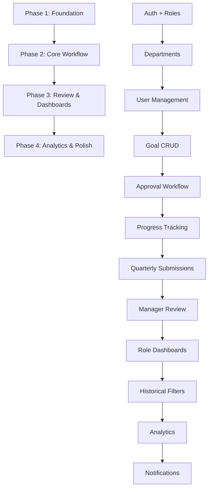

# GoalVerse — Agile Development Plan

## Project Architecture Overview



## Module Dependency Map

| Module | Depends On | Risk Level |
|---|---|---|
| Auth & Roles | None (foundational) | Low |
| Departments | Auth | Low |
| User Management | Auth, Departments | Low |
| Goal CRUD | Users, Departments | Medium |
| Approval Workflow | Goals, Manager role | Medium |
| Progress Tracking | Goals (approved) | Low |
| Quarterly Submissions | Progress, Goals | Medium |
| Manager Review | Submissions | Low |
| Employee Dashboard | Goals, Submissions | Low |
| Manager Dashboard | Goals, Approvals, Team | Medium |
| HR Dashboard | All modules | High |
| Historical Filtering | Goals, Submissions | Low |
| Analytics | All data modules | Medium |
| Notifications | All workflow modules | Low (optional) |

## MVP Critical Path

```
Auth → Departments → Users → Goals → Approvals → Progress → Submissions → Dashboards
```

> [!IMPORTANT]
> Every sprint MUST produce a working, testable mini-version. No sprint should leave the app in a broken state.

## Feature Classification

| Category | Features |
|---|---|
| **MVP Critical** | Auth, Roles, Departments, User Mgmt, Goal CRUD, Approval Flow, Progress Tracking, Quarterly Submissions, Manager Review, 3 Role Dashboards |
| **MVP Nice-to-Have** | Activity Logs, Historical Filtering, Basic Analytics |
| **Post-MVP / Optional** | Notifications, Advanced Analytics, Export/PDF, Email Alerts |
| **Out of Scope** | AI Analytics, Teams Integration, Entra ID, Multi-level Approvals, Real-time Chat, Complex Appraisal Scoring |

---

# PHASE 1: FOUNDATION (Sprints 1–2)

> Goal: Authentication, roles, departments, and user management working end-to-end.

---

## Sprint 1 — Auth, Roles & Database Foundation

### Sprint Goal
Stand up the database, implement authentication, and enforce role-based access. By sprint end: users can register/login, and the system recognizes Employee/Manager/HR roles.

### Features to Build
- Database schema creation (all 6 tables)
- User registration (HR-only creates users)
- Login / Logout
- JWT or session-based auth
- Role-based route protection
- Password hashing
- Seed HR/Admin account

### Database Changes
```sql
-- Create ALL tables in this sprint (schema-first approach)
CREATE TABLE departments (id, name, created_by, created_at);
CREATE TABLE users (id, name, email, password_hash, role, department_id, manager_id, is_active, created_at);
CREATE TABLE goals (id, employee_id, title, description, target_value, current_progress, uom_type, priority, year, quarter, status, approval_status, manager_comment, created_at, updated_at);
CREATE TABLE quarterly_checkins (id, goal_id, employee_id, year, quarter, final_progress, status, employee_note, manager_feedback, submission_status, submitted_at, reviewed_at);
CREATE TABLE activity_logs (id, goal_id, user_id, action_type, old_value, new_value, note, created_at);
CREATE TABLE notifications (id, user_id, title, type, is_read, created_at);
```

> [!TIP]
> Create ALL tables upfront even if unused yet. This prevents migration headaches later and lets you validate FK relationships early.

### Backend Tasks
1. Initialize project, install dependencies
2. Database connection + schema migration
3. Seed default HR/Admin user
4. `POST /api/auth/login` — authenticate, return token
5. `POST /api/auth/logout` — invalidate session
6. Auth middleware — verify token on protected routes
7. Role middleware — check `req.user.role` against allowed roles
8. `GET /api/auth/me` — return current user profile

### Frontend Tasks
1. Project scaffold + routing setup
2. Login page (email + password form)
3. Auth context/state management
4. Protected route wrapper component
5. Redirect logic based on role after login
6. Basic layout shell (sidebar placeholder + header)

### API Requirements
| Method | Endpoint | Auth | Roles | Purpose |
|---|---|---|---|---|
| POST | `/api/auth/login` | No | All | Login |
| POST | `/api/auth/logout` | Yes | All | Logout |
| GET | `/api/auth/me` | Yes | All | Current user |

### Validation Rules
- Email: valid format, unique
- Password: min 8 chars
- Role: enum `[employee, manager, hr_admin]`
- Failed login: generic "Invalid credentials" (no email leak)

### Dashboard Components
- None yet — login screen only

### User Flow Impact
- HR admin can login with seeded account
- Other roles cannot yet be created (next sprint)
- All protected routes redirect to login if unauthenticated

### Git Commit Breakdown
```
commit 1: chore: initialize project structure and dependencies
commit 2: feat(db): create database schema — all 6 tables
commit 3: feat(db): add seed script for default HR admin user
commit 4: feat(auth): implement login endpoint with JWT
commit 5: feat(auth): implement logout endpoint
commit 6: feat(middleware): add auth + role-based middleware
commit 7: feat(api): add GET /auth/me endpoint
commit 8: feat(ui): create login page with form validation
commit 9: feat(ui): add auth context and protected route wrapper
commit 10: feat(ui): add post-login redirect by role
commit 11: feat(ui): create app layout shell with header
```

### Testing Checklist
- [ ] DB tables created with correct columns and constraints
- [ ] Seeded HR admin can login successfully
- [ ] Invalid credentials return 401
- [ ] JWT/session token returned on successful login
- [ ] Protected routes return 401 without token
- [ ] `/auth/me` returns correct user data
- [ ] Frontend login form validates inputs
- [ ] Successful login redirects to appropriate dashboard stub
- [ ] Logout clears token and redirects to login

### Expected Output After Sprint
A working login system. HR admin can authenticate. All other routes are protected. Database is fully scaffolded. App shell renders with sidebar placeholder.

---

## Sprint 2 — Departments & User Management

### Sprint Goal
HR/Admin can create departments, create managers, create employees, and assign employees to managers. By sprint end: full user lifecycle management is working.

### Features to Build
- Department CRUD (HR only)
- Create Manager (HR assigns to department)
- Create Employee (HR assigns to department + manager)
- User listing with filters
- Edit user (role, department, manager, active status)
- Deactivate user (soft delete)
- Constraint: employee must have manager
- Constraint: show warning if no manager in department

### Database Changes
- No schema changes (tables exist from Sprint 1)
- Insert operations for `departments` and `users`

### Backend Tasks
1. `POST /api/departments` — create department
2. `GET /api/departments` — list all departments
3. `PUT /api/departments/:id` — update department
4. `GET /api/departments/:id/managers` — list managers in department
5. `POST /api/users` — create user (HR only)
6. `GET /api/users` — list users with role/department filters
7. `GET /api/users/:id` — get user detail
8. `PUT /api/users/:id` — update user
9. `PATCH /api/users/:id/deactivate` — soft deactivate
10. Validation: employee must have `manager_id`
11. Validation: manager must have `department_id`

### Frontend Tasks
1. Department management page (create, list, edit)
2. User creation form — dynamic fields based on role selection
3. Department dropdown in user form
4. Manager dropdown filtered by selected department
5. "No manager available" warning when department has no managers
6. User listing page with role/department filter tabs
7. User detail/edit modal or page
8. Deactivate user toggle
9. Sidebar navigation: Departments, Users

### API Requirements
| Method | Endpoint | Auth | Roles | Purpose |
|---|---|---|---|---|
| POST | `/api/departments` | Yes | HR | Create department |
| GET | `/api/departments` | Yes | HR | List departments |
| PUT | `/api/departments/:id` | Yes | HR | Update department |
| GET | `/api/departments/:id/managers` | Yes | HR | Managers in dept |
| POST | `/api/users` | Yes | HR | Create user |
| GET | `/api/users` | Yes | HR | List users |
| GET | `/api/users/:id` | Yes | HR, Manager | User detail |
| PUT | `/api/users/:id` | Yes | HR | Update user |
| PATCH | `/api/users/:id/deactivate` | Yes | HR | Deactivate |

### Validation Rules
- Department name: required, unique, max 100 chars
- User name: required, max 100 chars
- User email: required, unique, valid format
- Role: required, enum
- Employee: `manager_id` required, `department_id` required
- Manager: `department_id` required, `manager_id` nullable
- Cannot deactivate a manager who has active employees (warn or reassign)

### Dashboard Components
- HR Sidebar: Departments link, Users link
- Department list table
- User list table with filter chips

### User Flow Impact
- HR can now create the organizational structure
- Departments → Managers → Employees (creation order enforced by UI)
- Created users can now login

### Git Commit Breakdown
```
commit 1: feat(api): department CRUD endpoints
commit 2: feat(ui): department management page
commit 3: feat(api): user creation endpoint with role validation
commit 4: feat(api): user listing with role/department filters
commit 5: feat(api): user update and deactivate endpoints
commit 6: feat(ui): user creation form with dynamic role fields
commit 7: feat(ui): department/manager dropdown with dependency
commit 8: feat(ui): "no manager available" warning logic
commit 9: feat(ui): user listing page with filter tabs
commit 10: feat(ui): user edit and deactivate functionality
commit 11: feat(ui): sidebar navigation for HR admin
```

### Testing Checklist
- [ ] HR can create department
- [ ] Duplicate department name rejected
- [ ] HR can create manager assigned to department
- [ ] HR can create employee assigned to department + manager
- [ ] Employee creation without manager fails validation
- [ ] Manager dropdown only shows managers from selected department
- [ ] "No manager available" warning shows for empty departments
- [ ] User listing filters by role and department
- [ ] User can be deactivated
- [ ] Deactivated user cannot login
- [ ] Created manager/employee can login with correct role redirect
- [ ] Non-HR users cannot access department/user management

### Expected Output After Sprint
HR admin can build the entire org structure. Departments exist. Managers and employees are created and assigned. All users can login. Role-based access is enforced. The foundation for goal management is ready.

---

# PHASE 2: CORE WORKFLOW (Sprints 3–5)

> Goal: Goal lifecycle — creation, approval, progress tracking — fully working.

---

## Sprint 3 — Goal CRUD & Employee Goal View

### Sprint Goal
Employees can create goals with all required fields (title, description, UoM, target, quarter/year). Goals appear in employee's personal view. By sprint end: employees have a functional goal management interface.

### Features to Build
- Goal creation form (employee)
- Goal listing (employee sees own goals only)
- Goal detail view
- Goal edit (only in Draft/Pending status)
- Goal delete (only in Draft status)
- Quarter/Year selector
- UoM type selector (Numeric, Percentage, Timeline, Zero-based)
- Auto-set status to "Pending Approval" on create
- Current quarter auto-detection

### Database Changes
- No schema changes
- Insert/update operations on `goals` table

### Backend Tasks
1. `POST /api/goals` — create goal (employee only)
2. `GET /api/goals` — list goals (scoped by role: employee=own, manager=team, hr=all)
3. `GET /api/goals/:id` — goal detail
4. `PUT /api/goals/:id` — update goal (employee, pre-approval only)
5. `DELETE /api/goals/:id` — delete draft goal
6. Auto-populate: `employee_id` from auth, `status=draft`, `approval_status=pending`
7. Quarter/year validation (valid quarter 1-4, year reasonable range)

### Frontend Tasks
1. "Create Goal" form with all fields
2. UoM type dropdown — show appropriate target input based on selection
3. Quarter and Year selectors (default to current)
4. My Goals page — table/card list of employee's goals
5. Goal status badges (color-coded)
6. Goal detail view/modal
7. Edit goal (only when status allows)
8. Delete draft goal with confirmation
9. Employee sidebar: My Goals, Create Goal

### API Requirements
| Method | Endpoint | Auth | Roles | Purpose |
|---|---|---|---|---|
| POST | `/api/goals` | Yes | Employee | Create goal |
| GET | `/api/goals` | Yes | All | List goals (scoped) |
| GET | `/api/goals/:id` | Yes | All | Goal detail |
| PUT | `/api/goals/:id` | Yes | Employee | Edit goal |
| DELETE | `/api/goals/:id` | Yes | Employee | Delete draft |

### Validation Rules
- Title: required, max 200 chars
- Description: optional, max 1000 chars
- Quarter: required, 1–4
- Year: required, current year or next year
- UoM type: required, enum `[numeric, percentage, timeline, zero_based]`
- Target value: required, positive number (or date for timeline)
- Priority: default `medium`, enum `[critical, high, medium, low]`
- Status: auto-set, not user-editable directly
- Edit: blocked if `approval_status != pending` and `status != draft`
- Delete: blocked if `status != draft`

### Dashboard Components
- Employee goal cards: Total / Completed / Pending / In Progress
- Goal list with status filters

### User Flow Impact
- Employee can now create and manage goals
- Goals are visible only to the creating employee
- Manager cannot yet see/approve goals (next sprint)

### Git Commit Breakdown
```
commit 1: feat(api): goal creation endpoint with validation
commit 2: feat(api): goal listing scoped by user role
commit 3: feat(api): goal detail, update, and delete endpoints
commit 4: feat(ui): create goal form with UoM type selector
commit 5: feat(ui): quarter/year selector with current quarter default
commit 6: feat(ui): my goals page with status badges
commit 7: feat(ui): goal detail view
commit 8: feat(ui): edit goal with status-based restrictions
commit 9: feat(ui): delete draft goal with confirmation dialog
commit 10: feat(ui): employee sidebar navigation update
```

### Testing Checklist
- [ ] Employee can create goal with all fields
- [ ] UoM type changes target input behavior correctly
- [ ] Goal created with status=draft, approval_status=pending
- [ ] Employee sees only own goals
- [ ] Goal detail view shows all fields
- [ ] Employee can edit draft/pending goals
- [ ] Employee cannot edit approved/in-progress goals
- [ ] Employee can delete only draft goals
- [ ] Quarter/year validation works
- [ ] Manager/HR cannot create goals (role restriction)
- [ ] Goal list filters by quarter/year

### Expected Output After Sprint
Employees have a complete goal creation and management interface. Goals exist in the database with correct structure. The system is ready for the approval workflow.

---
